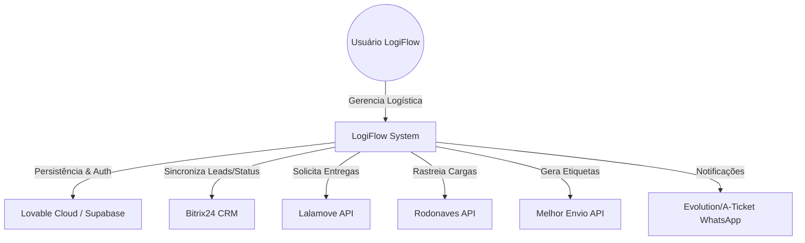
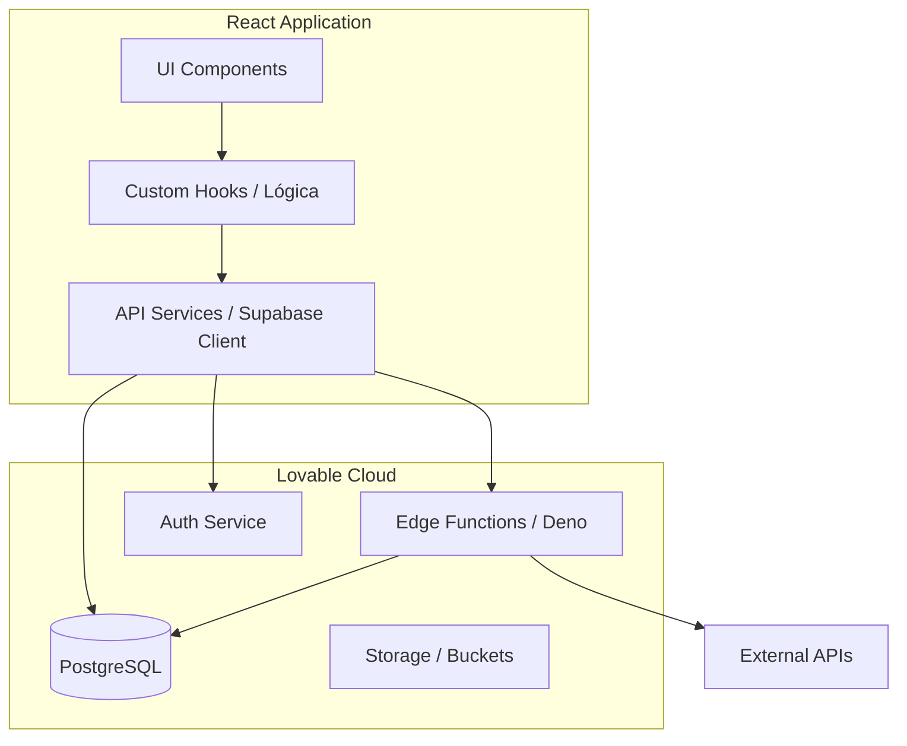
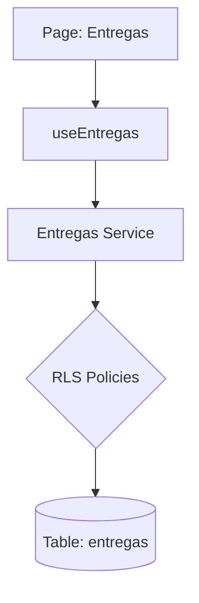

# C4 Architecture Model - LogiFlow

## Level 1: System Context Diagram

```mermaid
graph TD
    User((Usuário LogiFlow))
    System[LogiFlow System]
    Supabase[Lovable Cloud / Supabase]
    Bitrix24[Bitrix24 CRM]
    Lalamove[Lalamove API]
    Rodonaves[Rodonaves API]
    MelhorEnvio[Melhor Envio API]
    WhatsApp[Evolution/A-Ticket WhatsApp]

    User -->|Gerencia Logística| System
    System -->|Persistência & Auth| Supabase
    System -->|Sincroniza Leads/Status| Bitrix24
    System -->|Solicita Entregas| Lalamove
    System -->|Rastreia Cargas| Rodonaves
    System -->|Gera Etiquetas| MelhorEnvio
    System -->|Notificações| WhatsApp
```

## Level 2: Container Diagram

```mermaid
graph TD
    subgraph Frontend [React Application]
        UI[UI Components]
        Hooks[Custom Hooks / Lógica]
        Services[API Services / Supabase Client]
    end

    subgraph Backend [Lovable Cloud]
        EdgeFuncs[Edge Functions / Deno]
        DB[(PostgreSQL)]
        Storage[Storage / Buckets]
        Auth[Auth Service]
    end

    UI --> Hooks
    Hooks --> Services
    Services --> EdgeFuncs
    Services --> DB
    Services --> Auth
    EdgeFuncs --> DB
    EdgeFuncs --> ExternalAPIs[External APIs]
```

## Level 3: Component Diagram (Logistics Feature)

```mermaid
graph TD
    UI_Entregas[Page: Entregas]
    Hook_Entregas[useEntregas]
    Service_Entregas[Entregas Service]
    RLS_Policy{RLS Policies}
    DB_Table[(Table: entregas)]

    UI_Entregas --> Hook_Entregas
    Hook_Entregas --> Service_Entregas
    Service_Entregas --> RLS_Policy
    RLS_Policy --> DB_Table
```
