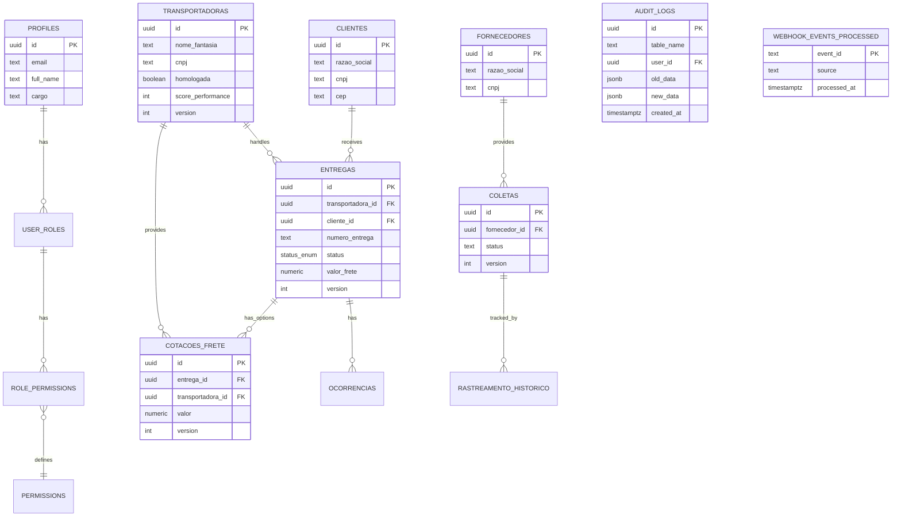

# ER Diagram - LogiFlow (Core Entities)

```mermaid
erDiagram
    PROFILES ||--o{ USER_ROLES : has
    PROFILES {
        uuid id PK
        text email
        text full_name
        text cargo
    }
    
    USER_ROLES ||--o{ ROLE_PERMISSIONS : has
    ROLE_PERMISSIONS }o--|| PERMISSIONS : defines

    TRANSPORTADORAS ||--o{ ENTREGAS : handles
    TRANSPORTADORAS ||--o{ COTACOES_FRETE : provides
    TRANSPORTADORAS {
        uuid id PK
        text nome_fantasia
        text cnpj
        boolean homologada
        int score_performance
        int version
    }
    
    CLIENTES ||--o{ ENTREGAS : receives
    CLIENTES {
        uuid id PK
        text razao_social
        text cnpj
        text cep
    }
    
    FORNECEDORES ||--o{ COLETAS : provides
    FORNECEDORES {
        uuid id PK
        text razao_social
        text cnpj
    }
    
    ENTREGAS ||--o{ OCORRENCIAS : has
    ENTREGAS ||--o{ COTACOES_FRETE : has_options
    ENTREGAS {
        uuid id PK
        uuid transportadora_id FK
        uuid cliente_id FK
        text numero_entrega
        status_enum status
        numeric valor_frete
        int version
    }
    
    COTACOES_FRETE {
        uuid id PK
        uuid entrega_id FK
        uuid transportadora_id FK
        numeric valor
        int version
    }

    COLETAS ||--o{ RASTREAMENTO_HISTORICO : tracked_by
    COLETAS {
        uuid id PK
        uuid fornecedor_id FK
        text status
        int version
    }
    
    AUDIT_LOGS {
        uuid id PK
        text table_name
        uuid user_id FK
        jsonb old_data
        jsonb new_data
        timestamptz created_at
    }

    WEBHOOK_EVENTS_PROCESSED {
        text event_id PK
        text source
        timestamptz processed_at
    }
```
