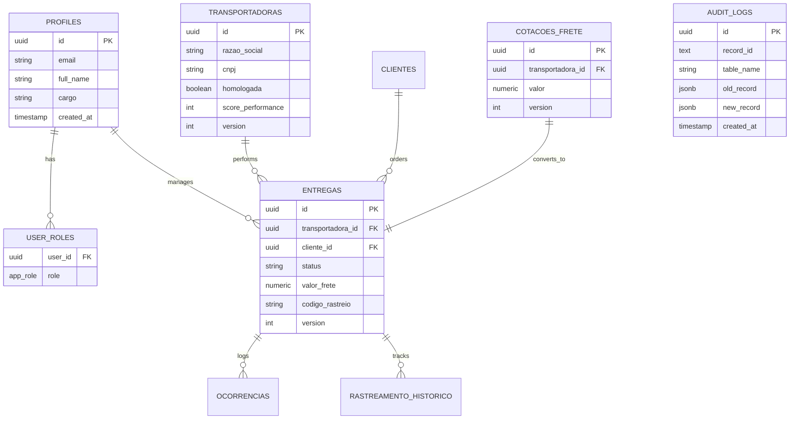

# Entity Relationship Diagram - LogiFlow

```mermaid
erDiagram
    PROFILES ||--o{ USER_ROLES : has
    PROFILES ||--o{ ENTREGAS : manages
    TRANSPORTADORAS ||--o{ ENTREGAS : performs
    CLIENTES ||--o{ ENTREGAS : orders
    ENTREGAS ||--o{ OCORRENCIAS : logs
    ENTREGAS ||--o{ RASTREAMENTO_HISTORICO : tracks
    COTACOES_FRETE ||--|| ENTREGAS : converts_to

    PROFILES {
        uuid id PK
        string email
        string full_name
        string cargo
        timestamp created_at
    }

    USER_ROLES {
        uuid user_id FK
        app_role role
    }

    TRANSPORTADORAS {
        uuid id PK
        string razao_social
        string cnpj
        boolean homologada
        int score_performance
        int version
    }

    ENTREGAS {
        uuid id PK
        uuid transportadora_id FK
        uuid cliente_id FK
        string status
        numeric valor_frete
        string codigo_rastreio
        int version
    }

    COTACOES_FRETE {
        uuid id PK
        uuid transportadora_id FK
        numeric valor
        int version
    }

    AUDIT_LOGS {
        uuid id PK
        text record_id
        string table_name
        jsonb old_record
        jsonb new_record
        timestamp created_at
    }
```
